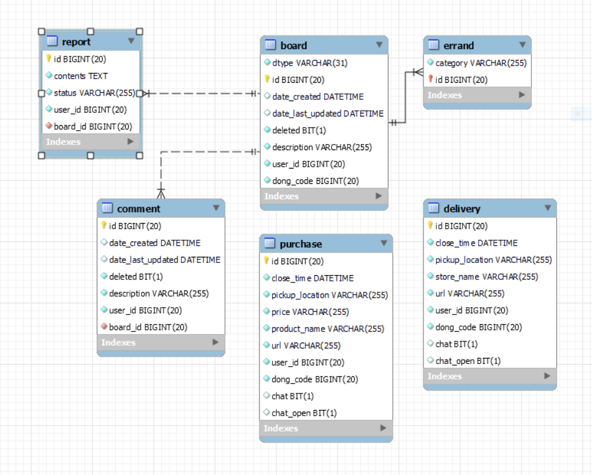
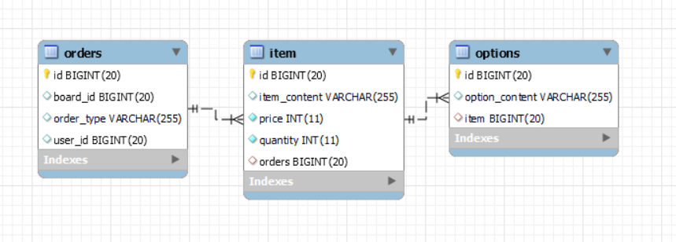
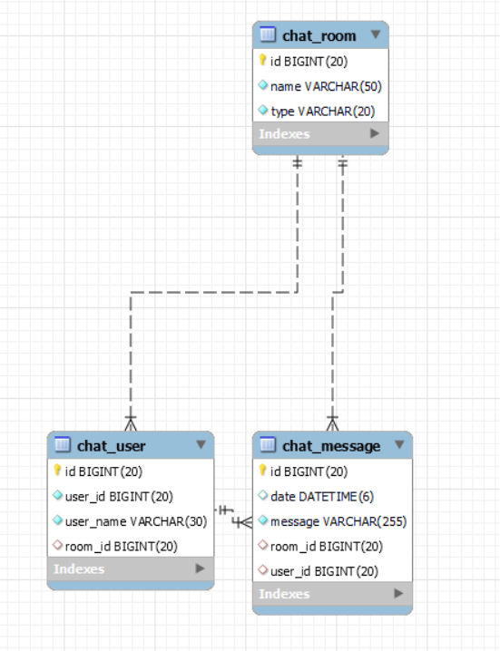
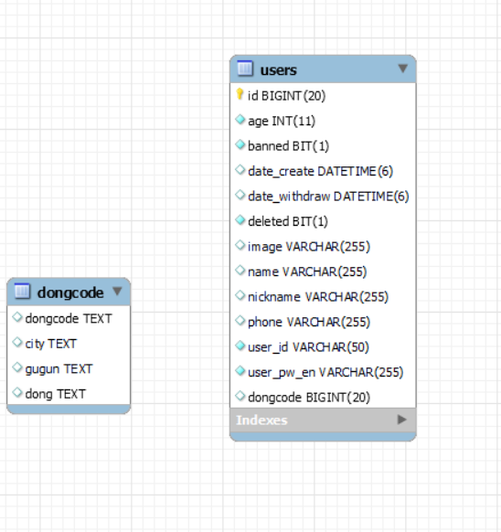
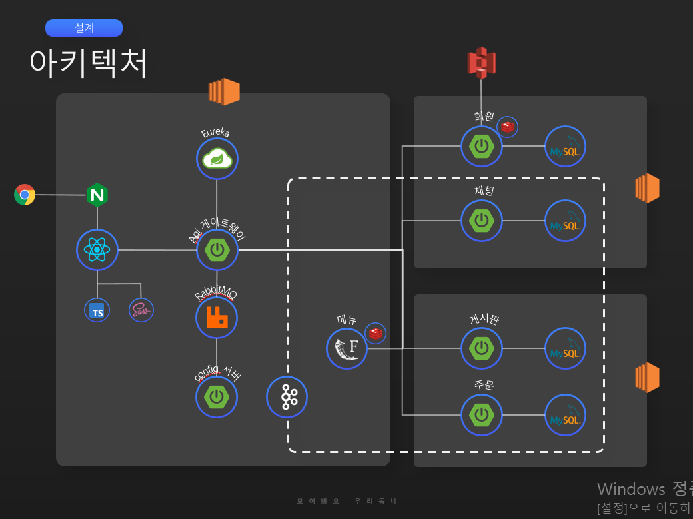

# README

---

### **1. 프로젝트 주제**

- 이웃 간의 소통과 공동 배달, 공동 구매를 위한 어플리케이션

- 작업 기간: 2022.04.11 ~ 2022.05.20

### **2. 기획 배경**

- 실제 배달비는 최근 크게 올랐다. 배달 업계에 따르면 배달대행업체는 연초부터 수도권을 중심으로 기본 배달료를 500~1000원 일괄 인상했다. 통상 4000~4500원의 기본요금에 주말ㆍ심야ㆍ폭설ㆍ폭우 시 할증이 붙는데, 경우에 따라 6000~7500원까지 오르는 경우도 생겼다.
    - 8일 국세청 사업자 통계를 통해 업종별 외식사업체 현황을 전수 분석한 결과 지난 1월 기준 전국 커피음료점은 7만1906곳으로 전년 동기 대비 15.5% 불어났다.
- MZ세대들은 이러한 배달비를 조금이라도 아끼기 위해 공동 배달과 공동 구매를 통해 이 문제를 해결하려 하였다
    - KB금융 지주 경영 연구소가 최근 내놓은 ‘커피전문점 현황 및 시장 여건 분석’ 보고서에 따르면 카페의 연간 폐업률(그해 폐업한 매장 수/전년도 총 매장 수×100)은 2018년 기준 14.1%로 치킨집(10.0%)보다 높다. 2013년 11.0%에서 더 높아졌다. 2018년 폐업한 카페의 절반 이상(52.6%)이 영업 기간 3년 미만인 신생 업체들이었다.
    - 출처 : 시사저널(http://www.sisajournal.com)
- 코로나19 영향으로 집 안에서 생활하는 시간이 예전보다 늘어나면서 사람들에게는 갈등 해결을 위해서도 이웃 간의 소통이 더욱 필요한 시점이 되었다. 하지만 이웃 간의 갑작스러운 접근은 상대를 불안하게 할 수 있음으로 우리는 이전과는 다른 접근 방식이 필요하다.

**⇒ 공동 배달이나 공동 구매를 쉽고 빠르게 이용 가능하게하고 이웃 간의 소통을 위한 어플리케이션을 만든다.**

### **3. 주요 서비스**

- 이웃 간 소통을 위한 커뮤니티 기능
- 이웃과 공동 배달을 위한 게시판 제공
- 이웃과 공동 구매를 위한 게시판 제공
- 구매를 확정하기 위한 채팅 기능

### **4. 서비스 장점**

- 배달을 생각하는 사용자들이 쉽게 사람을 모아 싸게 배달을 이용 할 수 있다.
- 필요한 물품 구매시 대량으로 같이 구매해 이득을 얻을 수 있다.
- 게시판을 통해 이웃과 주변 정보나 간단한 정보를 공유하며 친해질 수 있다.
- 크롤링을 통해 가게의 메뉴를 받아올 수 있어 더욱 쉬운 배달 주문이 가능하다.
- 채팅을 통해 더 자세한 사항을 이야기 할 수 있다.

## ERD****✏️****

게시판 ERD

주문 ERD

채팅 ERD

유저 ERD

## 아키텍처 🔨

---

## **기술스택 📖**

---

### [Backend]

- Spring : 자바 프레임 워크
- Spring Security : jwt 를 이용한 로그인
- Flask : 파이썬 웹 프레임 워크
- Redis: 유저 정보및 크롤링 데이터 저장을위한 메모리
- Spring Cloud Gateway : 서비스 api 라우팅
- Spring Eureka : 서비스 등록 및 리스트저장
- kafka : 서비스간 비동기 통신을 위해 사용
- rabbitMq : config 파일을 mq 를 통해 전달
- STOMP : 채팅 기능 구현을 위해 사용
- S3 : 유저이미지 저장 및 로드를 위해 사용
- mysql : CRUD 데이터 저장

### [Frontend]

- React : 인터페이스를 관리 위해 사용
- Redux : 데이터 상태 관리 위해 사용
- Redux-persist : redux의 데이터를 storage에서 데이터 관리
- React-router-dom : react에서 router로 페이지 관리를 위해 사용
- SCSS: CSS 전처리기를 활용한 UI 관리
- TypeScript : javascript에서 버그와 코드 관리를 용이하게 하기 위해 사용
- STOMP : 실시간 채팅을 위하여 사용

### [협업]

- GitLab : Git Flow에 따른 프로젝트 관리
- Jira : 매주 진행할 사항을 이슈로 등록하고 스토리 포인트 지정
- Notion: 협업에 필요한 문서 및 산출물 공유
- Figma : 목업과 플로우차트를 공유를 위한 프로그램

## **UI 💻**

---

### 로그인 회원가입 페이지

- [로그인 페이지]  : 어플리케이션에 로그인
- [회원가입 페이지] : 어플리케이션에 회원가입 주소 상세 선택가능

### 공동 배달 기능

- [공동 배달 주문 등록]  : 요기요 url을 통해 원하는 가게의 공동 배달을 시작 할 수 있다.
- [공동 배달 주문 신청 ]  : 크롤링을 통해 메뉴를 받아와 자신이 원하는 메뉴를 보고 주문 할 수 있다.
- [공동 배달 마감]: 공동 배달을 마감해 더 신청이 안되게 할 수 있고 채팅 방을 생성 할 수 있다.
- [내 주문 확인]: 공동 배달에서 내가 한 주문을 확인 할 수 있다.

### 공동 구매 기능

- [공동 구매 주문 등록]  : 원하는 물품의 공동 구매를 시작 할 수 있다.
- [공동 구매 주문 신청 ]  : 제품 정보를 확인하고 물건 구매를 준비 할 수 있다.
- [공동 구매 마감]: 공동 구매를 마감해 더 신청이 안되게 할 수 있고 채팅 방을 생성 할 수 있다.
- [내 주문 확인]: 공동 구매에서 내가 한 주문을 확인 할 수 있다.

### 커뮤니티

- [게시판 생성]  : 커뮤니티에 원하는 글 생성 가능
- [댓글 쓰기]  : 사용자가 원하는 게시글에 댓글 입력 가능

### 채팅

- [채팅]  : 공동 주문을 같이 주문한 맴버끼리 실시간 의사소통이 가능하다.

## 팀원 소개**🧑‍🤝‍🧑**

- **Backend: 조현아, 장현진, 박영찬**
- **Frontend:  정인수, 박신영**

---
